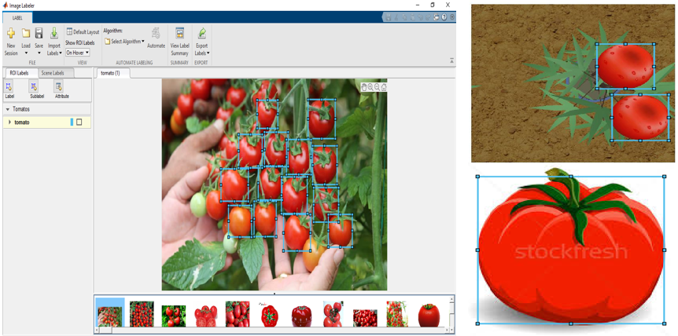

***DETECTION AND COUNT OF CROPS WITH DRONE SIMULATION***

Üzeyir Enes GÜRDEN -- Burak ÇINAR

AGU Electrical & Electronics Engineering Department

Asst. Prof. Samet GÜLER

AGU Electrical & Electronics Engineering Department

***Abstract: This paper mentions about one of the drones using area
which is we think will be very helpful, agricultural field. With the
increasing interest in unmanned aerial vehicles, drones have been
utilized in many social, industrial, and military applications. This is
one of the ideas and project could be developable. We did a simulation
on v-rep by using matlab.***

***Keywords: aerial vehicle, drone, agriculture, V-rep, Matlab,
Precision & Recall..***

#  Introduction 

First of all, we started this project according to the increasing
interest in unmanned aerial vehicle, drones. Drones have been utilized
in many social, industrial, and military applications. An interesting
application area of drones is surveillance over agricultural fields to
improve production quality and rate. The main purpose of this project is
to design and test a drone system which improves the production rate and
quality in agricultural fields. The system will comprise a drone
equipped with camera and onboard computational units to constantly
acquire aerial images of the fields. The system will be able to acquire
high quality images of fields and further analyze this imagery data both
onboard and offboard. The system will produce quantitative outputs which
will help gain more healthy products and reduce the time and effort
required in the production process. The general purpose of this project
is to implement the knowledge that we gained in the previous years and
our main purpose is to design a drone that provides to gain more yield
from agricultural products and time in the agricultural lands \[1\].

#  OBJECTIVE

## Problem in agricultural fields

This system will work on fields. So, there are some fundamental points
we should mention. Firstly, farmers have always a problem about finding
workers and time management for their products. If they can't handle one
of them, they will have a huge problem with their crops. Although there
are machines which work instead of people there are still somethings
that human beings should do. In this project we found out one problem
about that and tried to find a solution. As you know there are so much
agricultural field on earth and it can be like a hundred times bigger
than a football field. After the crop time, farmers have to check their
fields and crops if there is anything wrong and also before picking the
crops, they want to see them if it is the right time or not. So, this
system will save them time and have more healthier crops. Why we chose
this sector? Turkey has really efficient agricultural territory on earth
and since the past there have been so many people who earn their life in
this sector so we wanted to do something beneficial for our country and
for farmers in the world.

## Solution for the problem

## The purpose of our project is sending quadricopter to the set points which we certained specifically before and taking photos of the trees. Then detect the crops by training and decide how many of the crops are there and also how many of them are riped. This project will reduce the time for having better products by easily and more often checking up the field. A drone will be used to record the field's video and provide farmers with a guide on the field's situation. The drone will see and record a field even in the absence of farmers in the field. By processing the collected videos, farmers will obtain the field's state such as which parts of the field have crops planted and which parts need a particular attention. {#the-purpose-of-our-project-is-sending-quadricopter-to-the-set-points-which-we-certained-specifically-before-and-taking-photos-of-the-trees.-then-detect-the-crops-by-training-and-decide-how-many-of-the-crops-are-there-and-also-how-many-of-them-are-riped.-this-project-will-reduce-the-time-for-having-better-products-by-easily-and-more-often-checking-up-the-field.-a-drone-will-be-used-to-record-the-fields-video-and-provide-farmers-with-a-guide-on-the-fields-situation.-the-drone-will-see-and-record-a-field-even-in-the-absence-of-farmers-in-the-field.-by-processing-the-collected-videos-farmers-will-obtain-the-fields-state-such-as-which-parts-of-the-field-have-crops-planted-and-which-parts-need-a-particular-attention. .list-paragraph}

# APPROACH

## Mission planner

There will be objects which we used in positive instances. There are two
types of images for detection. One of them is positive images which mean
if there is an object that we are trying to detect in the photo. The
other one is 'negative images' which mean the objects other than
positives. There is an 'image labeler' property as in Figure 1. At
first, we upload images from the load section. After we uploaded them,
we create a new label named 'object'. We label positive instances one by
one; every single label represents one positive sample. We used Cascade
Classifier Method to detect positive images. Our mission is complete the
tasks step by step in the Figure 2. In Cascade Object Detector, firstly
we upload thousands of positive and negative images. Then, we used train
cascade object detector function as given in Figure 2.1. A false alarm
rate is known as the probability of false detection. If it is been
decreased, results are better. In Figure 2.2, under the training stage
each point represents that machine scans all positive and negative
images and detect positive images, when it goes next point, machine
controls if detections are positive or negative. In every point the
machine continues to do same progress until the best result and save as
xml file. So, the greater the number of stages, the greater the amount
of training data the classifier requires. If we didn't choose feature
type specially the system would choose HOG (Histogram of Oriented
Gradients). Firstly, we tried HOG type but the results were a little
false rated because we couldn't adjust stage numbers as we wanted. The
machine adjusts stages itself in this feature type \[2\]. In Haar type,
it runs so slowly on stages and that takes so much time like hours or
even days \[3\]. So, we decided to do in LBP (Local Binary Patterns)
because we can adjust stages as we want. So, we increased stage number
and decreased false alarm rate and had the best results \[4\]. Finally,
in the vision.CascadeObjectDetector, system object detects objects in
images by sliding a window over the image. The detector then uses a
cascade classifier to decide whether the window contains the object of
interest. As an example, we used 1130 positive samples for red tomatoes
and 2112 negative samples \[5\].

	Figure 1	Labeling Positive Samples

{width="3.1875in"
height="2.6875in"}\
Figure 2 Cascade Classifier Method

{width="3.3333333333333335in"
height="1.1875in"}Figure 2.1 Train Cascade Object Detector

{width="3.4270833333333335in"
height="1.1145833333333333in"}Figure 2.2 Training Stages

## Motion planning

We command to the drone to go to certain coordinates, as in Figure 3,
where crops are and drone goes to these points to take images from a
certain height. Adjustments should be made so that the same objects
don't appear in different photos. These images are processed by the
vision sensor and the methods we mentioned are applied. The results are
given one by one and collectively \[6\].

{width="3.5833333333333335in"
height="0.53125in"}Figure 3 Adjusting Set Points

## Vision based crop detection

{width="3.34375in"
height="2.5625in"}Figure 4 Test Results of Ripe Tomatoes

{width="1.6145833333333333in"
height="2.5833333333333335in"}\
Figure 5 Test Results of Unripe Tomatoes

{width="3.0729166666666665in"
height="2.4479166666666665in"}\
Figure 6 Test Results of Rotten Tomatoes

As you see Figure 4,5 and 6, test results are like we expected.

{width="3.2604166666666665in"
height="1.7708333333333333in"}\
Figure 7 Neural Network Parameters

For our project, true positive samples are red, unripe and rotten
tomatoes (changeable according to object). False positive can be
anything other than positive samples but detected by machine. True
negatives can be anything other than positive samples but not detected
by machine. False negative is that although there is an object, machine
didn't detect.

Precision, also called positive predictive value, is the fraction of
relevant instances among the retrieved instances and is calculated by
below equation:

*Precision = TruePositive/(TruePositive+FalsePositive) (1)*

Recall, also known as sensitivity, is the fraction of the total amount
of relevant instances and is calculated by below equation \[7\]:

*Recall = TruePositive/(TruePositive + FalseNegative) (2)*

[\[CHART\]]{.chart}\
Figure 8 Cascade Parameters Analysis according to Test Results

# Algorıthm

\- Uploading positive and negative images

\- Labeling every single object in images

\- Training stage by stage and saving as .xml file

\- Drone goes to set point

\- Get the image by camera

\- Apply the detection

o Objects in the image are being compared with positive images from
training .xml file

o If(objects are similar){

surrounds the object with bounding box}

o Else{ Don't detect any object }

\- Counting the crops

o If ( ripe object is detected){

increase ripe counter }

o Else if( unripe object is detected){

increase unripe counter }

o Else if( rotten object is detected){

increase rotten counter }

-   Else{ Don't change counter}

> {width="2.90625in"
> height="2.8020833333333335in"}\
> Figure 9 Flow Chart

# Simulation

<https://www.youtube.com/watch?v=HtwfdUxCOLQ>

# Conclusion

In summary, large agricultural fields are controlled by farmers
manually, e.g., without any technological aid, to observe and detect
possible diseases and abnormalities in crops. This traditional method
usually leads to waste of time and effort. By using our system, farmers
will be able to observe their fields much easily and automatically,
produce more healthy crops, and spend less energy and time to control
their farms \[8\]. For our project, there were some unexpected results
on simulation because of lack of simulation. However, in the real images
we got results as much as we expected.

##### References

1.  G G. Sylvester, "E-Agriculture in Action: Drones for Agriculture ",
    Food and Agriculture Organization of the United Nations and
    International Telecommunication Union, Bangkok, 2018, pp.27-31

2.  Dalal, N., and B. Triggs. "Histograms of Oriented Gradients for
    Human Detection." IEEE Computer Society Conference on Computer
    Vision and Pattern Recognition. Volume 1, 2005, pp. 886--893

3.  Viola, P., and M. J. Jones. \"Rapid Object Detection using a Boosted
    Cascade of Simple Features.\" Proceedings of the 2001 IEEE Computer
    Society Conference. Volume 1, 15 April 2001, pp. I-511--I-518

4.  Ojala, T., M. Pietikainen, and T. Maenpaa. "Multiresolution
    Gray-scale and Rotation Invariant Texture Classification With Local
    Binary Patterns." IEEE Transactions on Pattern Analysis and Machine
    Intelligence. Volume 24, No. 7 July 2002, pp. 971--987.

5.  MathWorks," Train a Cascade Object Detector" ,
    https://www.mathworks.com/help/vision/ug/train-a-cascade-object-detector.html.

6.  ApiFunctions,"simSetObjectPosition",
    https://www.coppeliarobotics.com/helpFiles/en/apiFunctions.htm\#simSetObjectPosition

7.  MathWorks,"bboxPrecisionRecall",https://www.mathworks.com/help/vision/ref/bboxprecisionrecall.html

8.  J. Jensen, "Agricultural Drones: How Drones Are Revolutionizing
    Agriculture and How to Break into this Booming Market",Uav Coach,
    April 2019

9.  
